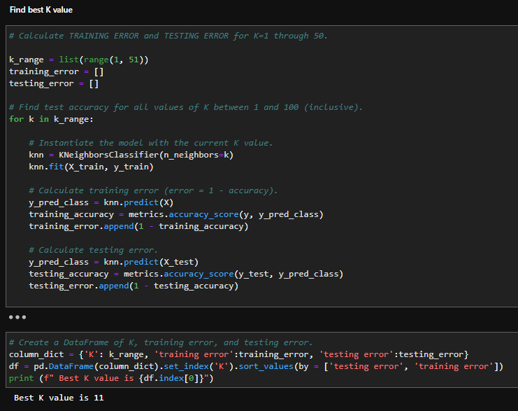
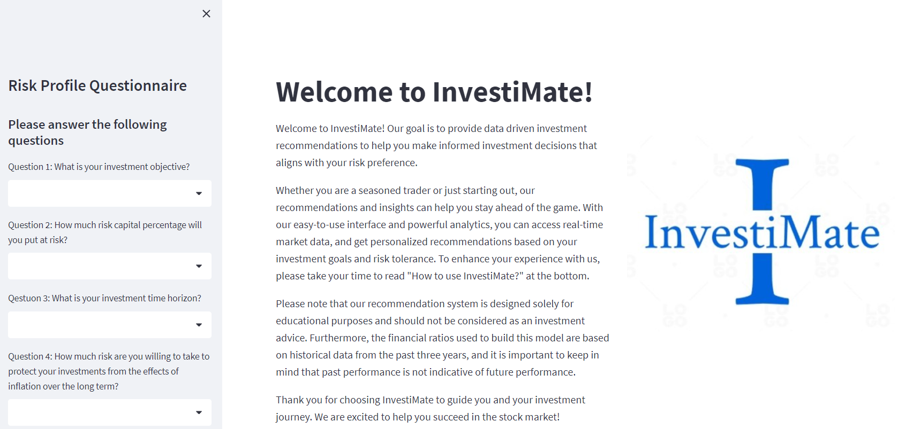

Stock Recommendation System Report

Table of Contents

[**1.** **Introduction**](#_Toc131117046)

[**2.** **Methodology**](#_Toc131117047)

[**2.1.** **Overview**](#_Toc131117048)

[**2.2.** **Dataset**](#_Toc131117049)

[**2.3.** **Obtaining Stock Symbols for Yfinance**](#_Toc131117050)

[**2.4.** **Feature engineering: Formulas and Explanations**](#_Toc131117051)

[**2.5.** **Clustering Model**](#_Toc131117052)

[**2.5.1.** **K-Means Clustering**](#k-means-clustering)

[**2.5.2.** **Exploring features using Correlation Matrix**](#exploring-features-using-correlation-matrix)

[**2.5.3.** **Post K-Means Clustering Results and Analysis**](#post-k-means-clustering-results-and-analysis)

[**2.5.4.** **Building The Different Portfolios Using Identified Clusters**](#building-the-different-portfolios-using-identified-clusters)

[**2.5.5.** **Validating the portfolio identified by K-Means Model**](#validating-the-portfolio-identified-by-k-means-model)

[**2.6.** **Classification Model**](#classification-model)

[**2.6.1.** **K-Nearest Neighbour (KNN) Classification Model**](#k-nearest-neighbour-knn-classification-model)

[**2.6.2.** **Comparing And selecting Classification Model**](#comparing-and-selecting-classification-model)

[**2.6.3.** **Testing and Validating KNN model**](#testing-and-validating-knn-model)

[**3.** **Streamlit Deployment**](#streamlit-deployment)

[**4.** **Tableau Dashboard for Company’s Internal Use**](#tableau-dashboard-for-companys-internal-use)

[**5.** **Summary**](#summary)

# Introduction

According to a survey done by [finder.com](https://www.finder.com/sg/investing-statistics), 37% of Singaporean who do not own stocks said they did not know where to start investing. As a result, they struggle to make informed investment decisions and may miss out on potential opportunities.

The goal of this project is to provide data driven investment recommendations that aligns with customer’s risk preferences and ensure that the returns of the recommended portfolios beat the S&P500 index. The system should provide a range of pre-defined portfolios that are tailored to different risk levels, enabling customers to choose the one that aligns with their investment risk tolerance at the same time.

The aim of this project is to utilize stock price data from various companies in the S&P 500 index to calculate financial metrics related to risk and return by employing feature engineering. To analyze the data and identify patterns and relationships, clustering and classification techniques will be used. Clustering will group similar companies based on their levels of risk and return, whereas classification models will be utilized to predict the labels of new, unseen data points. These techniques will help in identifying which companies are likely to have similar risk and return profiles and predict the labels of new data points based on their similarity to existing data points.

# Methodology

# Overview

The project will involve a multi-step approach, including feature engineering, model training, and validation. Clustering will be performed using the first three years of historical data (e.g., 2017-2020), and the results will be validated using the next three years of data (e.g., 2020-2023), which are unseen data. This approach will allow us to evaluate the performance of the clusters in predicting risk and return metrics for different companies within the S&P 500 index.

Similarly, classification models will be trained and validated using the same approach, with the performance of the models benchmarked against the cumulative returns of the S&P 500 index. By using this rigorous approach, I can assess the effectiveness of the models in predicting the labels of new, unseen data points accurately. Overall, this project aims to identify patterns and relationships within the stock price data and generate insights that can inform investment decisions.

## Dataset

The dataset for this project will be obtained exclusively from Yfinance, which is a Python library that allows for easy access to historical financial data from Yahoo Finance. Yfinance is a widely used tool among analysts, traders, and researchers for financial analysis and strategy development due to its reliability, ease of use, and the comprehensiveness of the data it provides. Moreover, it integrates seamlessly with Pandas library, which is another popular tool for data analysis in Python. The best part is that Yfinance is free, which makes it an excellent choice for this project.

## Obtaining Stock Symbols for Yfinance

Obtaining stock symbols for companies within the S&P 500 index can be a challenging and time-consuming task. However, there is a convenient and up-to-date list of S&P 500 companies' stock symbols available on [Wikipedia](https://en.wikipedia.org/wiki/List_of_S%26P_500_companies). By using the “pandas.read_html” function shown in Snippet 1, I can easily retrieve the symbol column from this table and create a list of symbols in Python.

Snippet 1 pandas.read_html snippet code

Once I have the list of symbols, I can use the Yfinance library to download historical stock price data from Yahoo Finance within the specified date range. The “yf.download” function shown in Snippet 2 can be used to retrieve data for multiple stocks at once, making the process more efficient. In addition, I have retrieved the S&P 500 price data to be used for benchmarking later on.

Snippet 2 yf.download snippet code

Before proceeding with the analysis, some data cleaning was required due to truncation of the table. The first step involved resetting the index, changing the symbols from row to column, and sorting the data based on date and symbol. Next, the column names were renamed into small caps, and only the necessary columns were selected, as shown in Snippet 3. These steps were necessary to ensure that the data was properly formatted.

Table 1 Truncated Table

Snippet 3 Data cleaning code snippet

# Feature engineering: Formulas and Explanations

Feature engineering is a crucial step in developing effective machine learning models, and it requires a solid understanding of the domain. I did some research on key financial metrics to ensure that the models I develop accurately reflect the risks and returns associated with stock prices. Based on research done, the metrics I selected to use as features in my models include annual returns, volatility, daily change, daily variation, max drawdown, sharpe ratio, and beta. Metrics are calculated using the 3 years (2017-2020) daily high, low, and adjusted close stock price data using Python. The formulas used to compute each metric and brief explanation are outlined below.

**Explanation**

-   Annual returns: This metric reflects the percentage gain or loss of an investment over a specified period, in this case, one year. It helps to assess the profitability of an investment.
-   Annual Volatility: This metric measures the variability of the stock price over time. Higher volatility means higher risk and potential higher returns.
-   Daily change: This metric reflects the daily percentage change in the stock price, which helps to understand how much the stock price fluctuates on a daily basis.
-   Daily variation: This metric is similar to volatility, but it considers the absolute value of the daily percentage changes in the stock price.
-   Annual Max drawdown: This metric measures the largest loss an investor would have incurred if they bought at the peak of the market and sold at the bottom over a certain time period. It helps to understand the maximum loss that an investor may potentially experience.
-   Sharpe ratio: This metric helps to measure the risk-adjusted return of an investment. It considers the return of the investment relative to the risk-free rate and the volatility of the investment.
-   Beta: This metric reflects the sensitivity of the stock price to market movements. A beta greater than 1 indicates higher volatility and risk, while a beta less than 1 indicates lower volatility and risk.

**Formula**

1.  Annualized Returns (R) formula:

    R = [(P_end / P_start)\^(1/n)] – 1  
     Where P_end is the ending price, P_start is the starting price, and n is the number of periods (usually days) the investment was held.

2.  Annualized Volatility (σ) formula:

    σ = √(252) \* daily standard deviation Where 252 represents the number of trading days in a year.

3.  Annualized Daily Change formula:

    Daily Change = (P_today - P_yesterday) - / P_yesterday  
    Annualized Daily Change = Average(Daily Change) \* √(252)

4.  Annualized Daily Variation formula:

    Daily Variation = [(P_high / P_low) ] / P_low  
    Annualized Daily Variation = Average(Daily Variation) \* √(252)

5.  Annualized Max Drawdown formula:

    Max Drawdown = (Peak Value - Trough Value) / Peak Value   
    Annualized Max Drawdown = [(1 - Max Drawdown)\^(252 / n)] - 1   
    Where n is the number of days in the investment period.

6.  Annualized Sharpe Ratio formula:

    Sharpe Ratio = (R_p - R_f) / σ_p   
    Annualized Sharpe Ratio = √(252) \* Sharpe Ratio   
    Where R_p is the portfolio return, R_f is the risk-free rate, and σ_p is the portfolio standard deviation.

7.  Annualized Beta formula: Beta = Covariance(stock returns, market returns) / Variance(market returns) Annualized Beta = Beta \* (√(252))

## Clustering Model

### K-Means Clustering

K-means Clustering is an unsupervised machine learning model used to group similar data points together based on their features. It works by iteratively assigning data points to clusters based on their proximity to the centroids and updating the centroids until convergence is achieved. Hence for my project, I will be using K-Means Clustering as my clustering model.

### Exploring features using Correlation Matrix

In order to examine the interrelationships between the features and identify any redundant features that may explain the same information, a correlation matrix was plotted, as shown in Figure 1. The results show that most of the features are not strongly correlated with each other, except for annual daily variation and annual volatility. Although these two features are highly correlated, they represent different aspects of the stock prices. Annual daily variation refers to the annualized average change of daily prices between high and low, while annual volatility measures the degree of variation in stock prices around the mean return. Hence, it is important to retain both features in the analysis as they provide distinct information.

Figure 1 Correlation Matrix

### Post K-Means Clustering Results and Analysis

In order to determine the optimal number of clusters (K) for the K-Means Clustering Model, I utilized two methods: elbow method and silhouette score. The elbow method involves plotting the relationship between the number of clusters and the within-cluster sum of squares (WCSS) and selecting the K value at the "elbow" of the plot where the decrease in WCSS starts to level off. The silhouette score method calculates the mean distance between each point in a cluster and all other points in the nearest cluster, and the optimal K value is where the silhouette score is highest.

Based on the results from both methods (Figure 2 and 3), the optimal K value for my model was determined to be 3, which is also in line with what I had initially anticipated.

Figure 2 Elbow Plot and Silhouette Plot

Once the optimal number of clusters has been determined, the next step is to fit the features to the model. To visualize the grouping of each cluster, a scatter plot was created. Since the aim of this project is to provide recommendations that align with the customer’s risk preferences and ensure that the returns of the recommended portfolios beat the S&P500 index, the clusters were plotted against the annual volatility and returns. The result (figure 4) shows three distinct clusters which can be interpreted as low risk – low returns (Yellow – Cluster 2), moderate risk – moderate returns (Blue – Cluster 0), and high risk – high returns (Pink – Cluster 1). This allows for clear interpretation of the clusters and the identification of suitable portfolios for customers with varying risk preferences.

Figure 4 Scatter Plot for different Clusters

To gain insight into the correlation between each feature of the clusters, I utilized box plots and scatter plots (figure 4). My analysis showed that there were differences in the mean values and standard deviations of most features for each cluster, except for annual daily change. I then experimented by removing the annual daily change feature, which resulted in a slight improvement in the K-Means clustering silhouette score.

Furthermore, I observed the presence of outliers in the clusters from my analysis of the scatter plot (figure 4) and the box plots (figure 5-11). Despite this, I chose not to remove them, as they represent the performance of each portfolio during uncertain times when stock prices fluctuate unpredictably. These outliers provide crucial information for understanding the behaviour of the portfolios and should not be disregarded.

Figure 5 Clusters Annualised Returns Distribution Boxplot

Figure 6 Clusters Annualised Volatility Distribution Boxplot

Figure 7 Clusters Annualised Daily Change Distribution Boxplot

Figure 8 Clusters Annualised Daily Change Distribution Boxplot

Figure 9 Clusters Annualised Max Drawdown Distribution Boxplot

Figure 10 Clusters Sharpe Ratio Distribution Boxplot

Figure 11 Clusters Beta Distribution

### Building The Different Portfolios Using Identified Clusters

After identifying and assigning meaningful labels to each cluster, the next step is to create portfolios for each cluster. For ease of understanding, I will refer to each cluster as a portfolio going forward. The High Risk Portfolio will represent Cluster 1, the Moderate Risk Portfolio will represent Cluster 0, and the Low Risk Portfolio will represent Cluster 2.

Since this recommendation system is designed for the general public, I will only recommend the top 10 companies with the highest Sharpe ratio in each portfolio. This is because most people usually [have a portfolio of at least 10 companies](https://www.investopedia.com/ask/answers/05/optimalportfoliosize.asp). (Refer to Snippet 4 for an example)

Snippet 4 Snippet code and table of top 10 companies with highest sharpe ratio

### Validating the portfolio identified by K-Means Model

Back-testing is a crucial process for evaluating the performance of a stock portfolio. The objective of back-testing is to verify the reliability of the K-Means model and ensure that it provides effective recommendations. To accomplish this, the back-testing of each portfolio will be performed on "unseen data" such as the period between 2020 and 2023, where clustering is not performed on this data to validate the model's outcome.

From the results presented in Figure 12, we can observe that both the high-risk and moderate-risk portfolios have outperformed the S&P 500 index, while the low-risk portfolio has closely tracked the performance of the S&P 500 index. Additionally, we can see the volatility associated with each portfolio, which confirms my expectations and further demonstrates the effectiveness of the K-Means model in clustering the various companies into their respective portfolios.

Figure 12 Cumulative returns of portfolio over the years

In addition, I conducted an in-depth analysis of the sector allocation of each portfolio, and my findings revealed that each portfolio is well-diversified across various sectors. Remarkably, the sector allocation of each portfolio aligns with real-world market trends. For instance, as illustrated in Figure 13, we observed that 50% of the portfolio is allocated to the Information Technology sector, which is currently experiencing high volatility. This observation further reinforces the effectiveness of the K-Means clustering method in creating a diversified portfolio that considers all the relevant features mentioned earlier.

Figure 13 High Risk Portfolio Sector Allocation

Figure 14 Moderate Risk Portfolio Sector Allocation

Figure 15 Low Risk Portfolio Sector Allocation

## 

## Classification Model

### K-Nearest Neighbour (KNN) Classification Model

For this project, the KNN classification model has been selected as the primary supervised learning classifier. This model leverages proximity (represented by K parameter) to predict the grouping of individual data points, and it will be used to make predictions about the likelihood of new stocks belonging to a specific group, such as companies delisting from or newly listed on the S&P 500 index. To achieve this, the model will incorporate clustering labels obtained from the previous K-Means clustering model.

In this section, the training and validation process will follow a similar approach as the K-Means clustering model. To avoid redundancy, I will provide additional details on the training and validation process of the classification model without repeating what was discussed in the K-Means clustering model section.

### Comparing And selecting Classification Model

To determine the optimal value of K for the KNN model, a for loop was run, and it was found that the best K value was 11 as shown in Snippet 5. In addition, two other models, XG Boost and Random Forest Classifier, were compared to KNN to identify a model with a higher accuracy score. The performance of these classifiers is presented in Table 2.

Snippet 5 Finding the best K value for KNN model snippet code

Table 2 Score comparison between the different classification models

In order to confirm that the KNN Model was not overfitting, it was trained on the training set and the resulting accuracy score was compared to the accuracy score obtained from the test set. If the accuracy score of the training set is higher than that of the test set, it is indicative of overfitting. In this case, the accuracy score of the test set was higher than the accuracy score of the training set (as shown in Table 3). Although there was a slight difference between the two scores, it was not significant and considered acceptable, indicating that the model was not overfitting.

Table 3 Accuracy score comparison between train and test set for KNN model

To verify the credibility of the KNN model's performance, I also evaluated its precision, recall, and F1 score. As shown in Snippet 6, all the scores were above 90%, indicating that the KNN model is a dependable and robust model for our classification task.

Here is a [link](https://medium.com/analytics-vidhya/confusion-matrix-accuracy-precision-recall-f1-score-ade299cf63cd) to the explanation of these scores

Snippet 6 Scores for KNN model

### Testing and Validating KNN model

As previously discussed, the validation method used for the KNN model is similar to the one employed for the K-Means model. Therefore, this section will provide a brief overview of the results. The KNN model was trained using three years of data from 2018 to 2021 and validated using the subsequent one year of "unseen data" from 2021 to 2022, as illustrated in Figure 16.

Although there is a significant difference in the cumulative returns between the various portfolios obtained from the K-Means model, as shown in the validation results (Figure 12), compared to the KNN model (Figure 16), it's important to note that the K-Means model was validated using three years of data, whereas the KNN model was only validated using one year. The reason for limiting the data used for validating the model to one year is to simulate real-life market conditions, where most investors [rebalance or optimize their portfolios annually](https://www.investopedia.com/investing/rebalance-your-portfolio-stay-on-track/).

Figure 16 shows that both the High and Moderate Risk Portfolios still outperform the S&P 500 index, while the Low Risk Portfolio continues to closely track the index, as previously observed in Figure 12. However, it's worth noting that the Moderate Risk Portfolio performs slightly better than the High Risk Portfolio. This could be attributed to the fact that most of the companies in the High Risk Portfolio are in the Information Technology sector (Figure 17), while the majority of the companies in the Moderate Risk Portfolio are in the Healthcare sector (Figure 18). These two sectors performed differently during the COVID-19 pandemic, which may have contributed to the observed performance difference.

v

Figure 16 Cumulative returns over 1 year

Figure 17 High Risk Portfolio Sector Allocation

Figure 18 Moderate Risk Portfolio Sector Allocation

Figure 19 Low Risk Portfolio Sector Allocation

## Streamlit Deployment

Once the feature engineering and model selection process is complete, the next step is to deploy the recommendation system on live data. When the application is being loaded, at the backend, KNN classification model will be train on the dataset with labels obtained using K-Means model. After which, Yfinance library will be utilized to retrieve 3 years of stock price data for the companies listed in the S&P 500 index. The data is then processed to calculate the financial metrics required for the KNN classification model to predict, which the results will be stored in a cache. This prevents the need to re-run the model each time a user selects an option from the drop-down bar. To ensure that the data remains up-to-date, the cache is set to refresh every 4 hours.

On the user end, the application presents a Risk Profile Questionnaire, obtained from the [DBS website](https://www.dbs.com.sg/iwov-resources/media/vickers-pdf/Customer_Investment_Profile_Form.pdf), to determine the user's risk profile score. The user is then prompted to input their desired investment amount, which allows them to view a summary of the portfolio's past 3-year performance. This user-friendly interface ensures that users can easily access the information they need to make informed investment decisions.

[Link](https://investimate-jwwm-stockrecommendationsystem.streamlit.app/) to my stocks recommendation system

Snippet 7 Risk profile questionnaire

After the user submits their responses to the risk profile questionnaire, the application will automatically calculate their risk profile score and recommend a portfolio based on the score. The user will then be directed to a page where they can view the past 3 years of cumulative returns, year-on-year returns, companies included in the portfolio, sector allocation, and performance summary, as demonstrated in Snippets 8 and 9.

Snippet 8 Streamlit portfolio page

Snippet 9 Streamlit page continued

# Tableau Dashboard for Company’s Internal Use

As I work on my project, I realize that the recommendation system I developed could be a valuable tool for an investment team at a financial institute, therefore, I decided to build a dashboard for this purpose. The dashboard offers a comprehensive overview of stock portfolio data, enabling the team to make data-driven decisions easily.

The dashboard works similarly to my Streamlit application, as previously mentioned. It fetches current stock prices from Yahoo Finance, and then uses a KNN classification model to predict which portfolio each company belongs to.

The high-level summary of key performance metrics of each portfolio, such as CAGR, standard deviation, max drawdown, portfolio best years, and Sharpe ratio, provides the team with a fast and easy way to evaluate each portfolio's performance. Furthermore, comparing the portfolio's past three-year cumulative returns to the S&P500 offers context for performance comparison to a relevant market index.

The correlation scatterplot matrix of different portfolios is a valuable visualization that can aid the team in identifying correlations and patterns in the portfolio data. If there is an outlier stock impacting the portfolio's reliability significantly, it can be detected in the scatterplot matrix. The team can then investigate the reason for this outlier, determine whether it is due to market factors or issues with the stock itself, and decide to remove the outlier from the portfolio or adjust its weighting to reduce its impact.

Including the company names in the portfolios and sector allocation helps the team comprehend the composition of each portfolio and make informed decisions about future investments. Overall, the dashboard provides a comprehensive, customizable, and actionable view of portfolio data that can assist investment teams in making informed decisions.

[Link](https://public.tableau.com/app/profile/jethro8602/viz/StockRecommendationSystem/PortfoliosRecommendationDashboard) to portfolios recommendation dashboard

Snippet 10 Portfolio Recommendation Dashboard

# Summary

Overall, both K-Means and KNN models have shown promising results in clustering and classifying S&P 500 companies into different portfolios, with outperformance compared to the benchmark. The KNN model has also demonstrated high accuracy, recall, precision, and f1 score. However, it is important to exercise caution and due diligence as the stock market can be volatile and unpredictable, particularly during uncertain times. Ultimately, this recommender served as valuable tools in portfolio management and decision-making, but they should not be solely relied upon.
